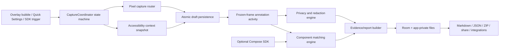

# Android Visual QA Companion
## Full Architecture and Implementation Plan

**Status:** Engineer handoff  
**Baseline date:** 28 July 2026  
**Primary platform:** Native Android, Kotlin, Jetpack Compose  
**Initial distribution:** Internal, enterprise, MDM, or sideloaded APK  
**Primary target:** Android 11+ (`minSdk 30`), optimized for Android 14–16  
**Architecture owner:** Native engineering lead

---

## 1. Executive decision

Build one product with a shared evidence model and two capture paths:

1. **OS-wide companion APK**
   - Works across unmodified Android apps.
   - Uses an `AccessibilityService` for best-effort component metadata.
   - Uses accessibility screenshots for fast still capture.
   - Uses `MediaProjection` only for an explicit high-fidelity or recording mode.
   - Treats all cross-app component matches as ranked evidence, never as guaranteed truth.

2. **Optional first-party enrichment SDK**
   - Added to apps the team controls, starting with Jetpack Compose.
   - Supplies stable component IDs, exact bounds, route, design-system metadata, privacy classification, build metadata, and optional breadcrumbs.
   - Emits the same report schema as the companion APK.

The default user flow is **capture first, then annotate a frozen frame inside this app**. Do not make live drawing over another app the primary workflow. A capture-first design avoids accidental taps, overlay blocking, coordinate drift, changing content, and screenshots containing the feedback bubble.

### Product statement

> Tap the feedback control, freeze the current app screen, circle or select what is wrong, explain it by voice or text, and produce an AI-ready report containing screenshots, candidate component metadata, app/device context, and optional first-party component identity.

---

## 2. Scope

### 2.1 MVP scope

The first production-quality vertical slice must support:

- Explicit user-triggered capture from a floating accessibility overlay and a Quick Settings tile.
- Current package, window, display, orientation, and device metadata.
- Accessibility tree snapshot.
- Screenshot capture with a clean fallback path.
- Full-screen frozen-frame annotation.
- Pen, highlighter, rectangle, arrow, eraser, undo, redo, and crop.
- Tap, rectangle, and freehand/lasso component selection.
- Candidate component ranking with visible confidence and rationale.
- Typed feedback and optional speech transcription.
- Manual redaction and automatic sensitive-field suggestions.
- Local report history.
- JSON, Markdown, and ZIP export.
- Share-sheet export and filesystem export.
- Resumption of unfinished reports after process death.

### 2.2 Deliberately excluded from MVP

Do not include these until the evidence workflow is reliable:

- Continuous background screen recording.
- Autonomous navigation or actions in another app.
- Automatic submission without a review screen.
- Cloud account system or multi-tenant backend.
- React Native SDK.
- OCR as a required source of truth.
- Google Play public launch.
- Default-notes-role integration.
- AI rewriting that replaces the original transcript.
- Source-file mapping based only on visual inference.

### 2.3 Hard product boundaries

- Never attempt to bypass `FLAG_SECURE` or other platform security controls.
- Never capture continuously by default.
- Never upload accessibility data before the user reviews the report.
- Never log raw screen text, screenshots, voice content, or accessibility trees.
- Never claim a cross-app accessibility node is the exact underlying composable.
- Never perform target-app actions through accessibility in the core product.

---

## 3. July 2026 technical baseline

Use a version catalog and pin exact dependency versions. Dependency updates must arrive through reviewed Renovate or Dependabot pull requests and pass the complete test suite.

| Area | Baseline |
|---|---|
| JDK | 17 |
| Android Gradle Plugin | 9.2.0 |
| Gradle | 9.4.1 |
| Kotlin | 2.4.10 |
| Compile SDK | 36 |
| Target SDK | 36 |
| Min SDK | 30 |
| Build Tools | 36.0.0 |
| Compose UI/Foundation/Runtime | 1.11.4 stable |
| Material 3 | 1.4.0 stable |
| AndroidX Ink | 1.0.0 |
| Language | Kotlin only for production code |
| UI | Jetpack Compose, edge-to-edge |
| Serialization | `kotlinx.serialization` |
| Async | Structured Kotlin coroutines and `Flow` |
| Persistence | Room for metadata, app-private files for attachments, DataStore for preferences |
| DI | Hilt, isolated behind constructor-injected interfaces |
| Performance | Macrobenchmark and Baseline Profiles |

### Why `minSdk 30`

The OS-wide product depends heavily on accessibility screenshot capture, introduced at API 30. Supporting API 29 or lower would add a separate MediaProjection-first capture architecture and materially increase complexity. Reconsider lower API support only after product validation.

### Android 16 requirements to design for immediately

- Full edge-to-edge UI and correct inset handling.
- Predictive back throughout the capture and editor flows.
- Adaptive layouts for tablets, foldables, freeform windows, and resized activities.
- Display and window bounds changing during a capture session.
- Multi-window and single-app screen-sharing coordinate differences.

---

## 4. System architecture



### Architectural rules

1. **One immutable evidence schema.** Every capture source maps into the same core model.
2. **Platform objects stop at adapter boundaries.** Never store `AccessibilityNodeInfo`, `Bitmap`, `HardwareBuffer`, `MediaProjection`, `View`, or `Context` in domain models.
3. **Capture is a state machine, not a collection of callbacks.** All callbacks become typed commands processed serially.
4. **Local storage is the source of truth.** Exporters read a persisted report, not live UI state.
5. **The report remains useful without AI.** AI enrichment is optional and additive.
6. **Privacy decisions are part of evidence.** Redaction is modeled and auditable, not destructive ad hoc bitmap editing.
7. **The companion and SDK share contracts, not Android lifecycle ownership.**

---

## 5. Recommended Gradle module structure

```text
visual-qa-android/
├── app/                         # Companion APK, navigation, screens, orchestration
├── build-logic/                 # Convention plugins and shared build rules
├── core/
│   ├── model/                   # Pure Kotlin immutable evidence/report schema
│   ├── geometry/                # Coordinate transforms, polygons, hit testing
│   ├── privacy/                 # Classification and redaction rules
│   ├── database/                # Room entities, DAO, migrations
│   ├── files/                   # Atomic attachment storage, hashing, encryption
│   ├── common-android/          # Small Android-only utilities; keep narrow
│   └── testing/                 # Fakes, fixtures, golden report corpus
├── capture/
│   ├── api/                     # Capture contracts and state machine types
│   ├── accessibility/           # Service, node snapshots, overlay trigger
│   └── pixels/                  # Accessibility screenshot and MediaProjection adapters
├── annotation/                  # Ink canvas, tools, stroke model, editor state holder
├── matching/                    # Pure deterministic candidate-ranking engine
├── report/                      # Report assembler, serializers, Markdown and ZIP
├── export/
│   ├── share/                   # Android share/file exports
│   ├── github/                  # Later: GitHub issue adapter
│   ├── jira/                    # Later: Jira issue adapter
│   └── agent/                   # Later: AI-agent/MCP payload adapter
├── sdk/
│   ├── compose-core/            # Platform-neutral SDK contracts where possible
│   └── compose/                 # VisualFeedbackHost and Modifier.feedbackTarget
├── sample/
│   ├── target-compose/          # Deterministic target app and edge-case screens
│   └── sdk-integration/         # Consumer integration sample
├── e2e/                         # UiAutomator/device integration tests
└── benchmark/                   # Macrobenchmark and Baseline Profile generation
```

### Avoid premature modularization

The modules above describe ownership boundaries. The engineer may initially keep small exporter or feature packages in `:app`, then extract them once APIs stabilize. Do not create one Gradle module per screen. Build time and public API maintenance matter more than visual symmetry.

### Dependency direction

```text
app -> capture, annotation, matching, report, export, core
capture:* -> capture:api, core:model, core:geometry
annotation -> core:model, core:geometry
matching -> core:model, core:geometry
report -> core:model, core:files
sdk:compose -> core:model or a deliberately smaller sdk contract module
core modules -> no app or feature module
```

Circular dependencies are prohibited. `:core:model`, `:core:geometry`, and `:matching` must remain runnable as plain JVM tests.

---

## 6. Core domain model

Use `@Serializable` immutable data classes. All externally persisted schemas include a version. Never rely on Kotlin class names as the wire format.

```kotlin
@Serializable
data class VisualFeedbackReport(
    val schemaVersion: Int,
    val reportId: ReportId,
    val createdAt: Instant,
    val status: ReportStatus,
    val capture: CaptureEvidence,
    val annotations: List<AnnotationEvidence>,
    val selections: List<ComponentSelection>,
    val feedback: FeedbackEvidence,
    val privacy: PrivacyEvidence,
    val attachments: List<AttachmentRef>,
    val exports: List<ExportAttempt>,
)
```

### Main entities

#### `CaptureSession`

- Session ID and monotonic start time.
- Trigger source.
- Capture mode.
- Current state.
- Recoverable error information.
- User-cancelled versus system-failed distinction.

#### `CaptureFrame`

- Display ID.
- Accessibility window ID.
- Package name.
- Optional activity/window title.
- Pixel dimensions.
- Density.
- Rotation.
- system-bar insets.
- Window bounds.
- Captured content bounds.
- Screenshot method.
- Timestamp from a monotonic clock and wall clock.
- Transform between coordinate spaces.

#### `NodeSnapshot`

An immutable flattened accessibility node, containing only required fields:

- Stable snapshot-local node ID.
- Parent ID and child IDs.
- Window ID and z-order.
- Bounds in screen.
- Text, content description, state description, hint, pane title, and view ID where exposed.
- Class and role.
- Enabled, selected, checked, clickable, focusable, editable, scrollable, password, visible-to-user.
- Supported action identifiers.
- Collection and item metadata.
- Privacy classification.
- Traversal depth.

Do not persist the complete raw accessibility object. Truncate text fields to a documented maximum and remove spans.

#### `SdkComponentSnapshot`

- Stable developer-provided key.
- Component type.
- Route/screen ID.
- Exact screen bounds.
- Semantic role and state.
- Test tag.
- Design-system tokens and variant.
- Source hint supplied by the host app, if explicitly configured.
- Build metadata.
- Privacy classification.

#### `AnnotationEvidence`

- Tool type.
- Stroke points in normalized frame coordinates.
- Pressure/tilt samples where retained.
- Bounding box and convex hull.
- Display transform at creation.
- Linked comment or transcript segment.
- Undo-group ID.

#### `ComponentSelection`

- Annotation ID.
- Chosen candidate.
- Top candidate list.
- Confidence.
- Feature-level score breakdown.
- Human choice: auto-selected, user-confirmed, parent/child override, or no match.
- Evidence source: accessibility, SDK, OCR, manual region.

#### `PrivacyEvidence`

- Secure-window result.
- Automatic redaction suggestions.
- User redactions.
- Fields excluded from serialization.
- Whether OCR or audio was used.
- Whether export left the device.

### Schema rules

- Start at `schemaVersion = 1`.
- Golden-test every schema version.
- Add fields with defaults whenever practical.
- Do not silently reinterpret an old field.
- Put migrations in a dedicated `ReportMigration` chain.
- Export both `report.json` and a human-readable `report.md`.
- Include a SHA-256 hash for every attachment.

---

## 7. Coordinate-system design

Most bugs in this product will be coordinate bugs. Make coordinate spaces explicit in type names rather than passing generic `Rect` and `Offset` values.

Required spaces:

- `ScreenPx`
- `WindowPx`
- `CapturePx`
- `EditorPx`
- `NormalizedFrame` (`0.0..1.0`)

```kotlin
@JvmInline value class ScreenX(val value: Float)
@JvmInline value class CaptureX(val value: Float)

data class FrameTransform(
    val screenToCapture: Matrix3,
    val captureToNormalized: Matrix3,
    val sourceRotation: Int,
)
```

### Rules

- Persist annotation points in normalized frame coordinates.
- Persist original node bounds in screen pixels plus the frame transform.
- Match only snapshots captured from the same window/display generation.
- If display, rotation, window, or content bounds change during capture, invalidate and restart the snapshot.
- Use immutable transforms and pure functions.
- Golden-test rotation, letterboxing, edge-to-edge insets, split screen, app-window capture, freeform windows, and tablets.

---

## 8. Capture state machine and concurrency model

### State machine

```text
Idle
  -> Armed
  -> SnapshottingContext
  -> CapturingPixels
  -> PersistingDraft
  -> LaunchingEditor
  -> Annotating
  -> Enriching
  -> Reviewing
  -> Saving
  -> Exporting
  -> Complete

Any active state -> Cancelled
Any active state -> Failed(recoverable | terminal)
Persisted states -> Resuming
```

### Command model

All external callbacks are converted into commands:

```kotlin
sealed interface CaptureCommand {
    data class Trigger(val source: TriggerSource) : CaptureCommand
    data class ContextReady(val snapshot: ContextSnapshot) : CaptureCommand
    data class PixelsReady(val frame: CapturedFrame) : CaptureCommand
    data class CaptureFailed(val reason: CaptureFailure) : CaptureCommand
    data object UserCancelled : CaptureCommand
    data class EditorSaved(val draftId: DraftId) : CaptureCommand
}
```

Process commands through a single serialized reducer using an actor-style `Channel`, or a `Mutex` around one state transition function. Do not let accessibility callbacks, screenshot callbacks, activity results, and persistence callbacks mutate shared state independently.

### Structured concurrency rules

- One application-owned `CaptureSessionScope` per active session.
- Child jobs for context snapshot and pixel capture may run concurrently after the trigger.
- They join before draft persistence.
- Cancelling the session cancels every child.
- Use explicit dispatchers injected through an interface.
- Never use `GlobalScope`.
- Main thread: lifecycle and Compose state only.
- Default dispatcher: tree normalization and matching.
- IO dispatcher: bitmap/file/Room operations.
- Limit bitmap encoding concurrency to one.

### Race conditions to test

- User triggers twice rapidly.
- Accessibility service disconnects after trigger.
- Activity starts before screenshot callback.
- Rotation occurs during screenshot.
- Target window changes between tree and screenshot.
- App process dies after screenshot but before editor launch.
- User cancels MediaProjection consent.
- Two export requests target the same report.
- Cleanup runs while a report is open.

---

## 9. OS-wide companion capture flow

### 9.1 Trigger mechanisms

Implement in this order:

1. **Accessibility overlay bubble** using `TYPE_ACCESSIBILITY_OVERLAY`.
2. **Quick Settings tile** as a reliable alternative.
3. Notification action while the service is active.
4. Optional hardware/stylus shortcut later where OEM APIs permit it.

Avoid requesting `SYSTEM_ALERT_WINDOW` unless a demonstrated use case cannot be met by accessibility overlays.

### 9.2 Capture transaction

1. User taps the capture trigger.
2. Coordinator rejects duplicate triggers and records a monotonic timestamp.
3. Temporarily hide or make the feedback bubble non-capturable.
4. Resolve the active application window.
5. Snapshot window and accessibility nodes into immutable objects.
6. In parallel, request pixels:
   - API 34+: prefer `takeScreenshotOfWindow(windowId)`.
   - API 30–33: use display `takeScreenshot()` and crop using captured window bounds.
   - If accessibility screenshot is unavailable, offer MediaProjection or manual screenshot import.
7. Confirm package, window ID, display ID, bounds, and timestamp are compatible.
8. Persist screenshot and context to a draft directory atomically.
9. Launch the editor activity with only a draft ID.
10. Editor loads all evidence from storage.

### 9.3 Screenshot router

```kotlin
interface PixelCaptureSource {
    suspend fun capture(request: PixelCaptureRequest): PixelCaptureResult
}

class PixelCaptureRouter(
    private val windowScreenshot: AccessibilityWindowScreenshotSource,
    private val displayScreenshot: AccessibilityDisplayScreenshotSource,
    private val mediaProjection: MediaProjectionSource,
    private val manualImport: ManualImportSource,
)
```

The router chooses a source based on API, service capability, window type, active session permission, user choice, and previous failure.

### 9.4 MediaProjection mode

MediaProjection is not the default still-capture path. Use it for:

- Short narrated recording.
- Higher-fidelity repeated frames.
- Single-app sharing when accessibility screenshots are unavailable.
- Capturing animation or timing defects.

Requirements:

- Explicit system consent per session.
- Correct foreground-service type and visible notification.
- Register `MediaProjection.Callback` before creating the virtual display.
- Stop cleanly when the user or system ends projection.
- Recreate size-dependent surfaces when captured content changes dimensions.
- Never reuse a consumed projection token.

### 9.5 Secure and blocked content

Map failures to user-visible outcomes:

- Secure screenshot failure: create a **text-only report** with package/window metadata and no image.
- Overlay blocked: use Quick Settings trigger and annotate after capture.
- Empty or stale accessibility tree: retain screenshot and allow manual-region feedback.
- Cross-profile restriction: explain the limitation and do not retry indefinitely.

---

## 10. Accessibility service design

### Manifest capabilities

Use the minimum configuration required:

- `android.permission.BIND_ACCESSIBILITY_SERVICE`
- `canRetrieveWindowContent="true"`
- `canTakeScreenshot="true"`
- `flagRetrieveInteractiveWindows`
- `flagReportViewIds`
- Only event types needed for current-window state and a short recent-event buffer.

Do not enable broad event streams “just in case.” The service should perform a complete tree read only in response to an explicit capture action.

### Service responsibilities

- Expose service-enabled and capability state.
- Maintain lightweight current-window metadata.
- Keep a bounded, memory-only ring buffer of recent relevant events, for example 5–10 seconds.
- Create immutable node snapshots on demand.
- Request screenshots.
- Own the accessibility overlay trigger.
- Publish commands to `CaptureCoordinator`.

### Service non-responsibilities

- No report business logic.
- No Room access directly.
- No Markdown generation.
- No long-lived bitmap ownership.
- No network calls.
- No automatic actions in the target app.

### Tree traversal safeguards

- Iterative traversal, not unbounded recursion.
- Hard maximum node count, initially 3,000.
- Hard maximum depth, initially 80.
- Deadline, initially 150 ms on reference hardware.
- Cycle/duplicate detection using snapshot-local identity.
- Copy and sanitize text immediately.
- Recycle or release platform objects according to supported API behavior.
- Record truncation reason in the report.

---

## 11. Annotation editor

Use AndroidX Ink for low-latency stylus authoring and rendering. Keep annotation state separate from Compose rendering state.

### Tools

- Pen.
- Highlighter.
- Rectangle.
- Ellipse/circle.
- Arrow.
- Lasso/selection.
- Eraser.
- Text note.
- Blur/redaction rectangle.
- Undo/redo.

### Input behavior

- Stylus draws by default.
- Finger pans/zooms by default when a stylus is active.
- Finger can draw when explicitly enabled.
- Stylus eraser deletes or masks strokes.
- Hover may preview the component candidate beneath the pen on supported hardware.
- Palm input must not generate marks.

### Editor architecture

```text
AnnotationScreen
  -> AnnotationStateHolder (plain Kotlin state holder)
      -> InkStrokeRepository
      -> ViewportController
      -> SelectionController
      -> UndoManager
      -> RedactionController
```

Do not put high-frequency stroke samples into a screen-level `ViewModel` or Room during input. Persist after stroke completion and debounce draft checkpoints.

### Rendering layers

1. Frozen screenshot.
2. Redaction preview.
3. Candidate component bounds.
4. Ink strokes and shapes.
5. Selected-component handles.
6. Editor controls.

Keep the clean screenshot unchanged. Produce annotated and redacted derivatives during save/export.

---

## 12. Component matching engine

The matching engine is a pure deterministic library. It takes evidence and returns ranked candidates plus explanations.

### Inputs

- Stroke bounding rectangle.
- Convex hull or lasso polygon.
- Stroke centroid.
- Accessibility node snapshots.
- Recent event snapshots.
- Optional Compose SDK components.
- Optional OCR blocks.
- Window and coordinate transform.

### Candidate features

- Intersection-over-union.
- Percentage of candidate contained by the lasso.
- Percentage of lasso covered by the candidate.
- Center distance normalized by frame diagonal.
- Point-in-rectangle or polygon relationship.
- Interactive/actionable role.
- Text/content-description richness.
- Leaf-like versus container-like node.
- Node visible state.
- Window z-order.
- Recent focus/click/content-change event.
- Stable view ID or SDK key.
- SDK-bound overlap.
- Large-container penalty.
- Full-screen/root penalty.
- Password/sensitive penalty for automatic selection.

### Initial score shape

```text
score =
    0.28 * overlap
  + 0.16 * containment
  + 0.14 * centerProximity
  + 0.10 * actionable
  + 0.08 * semanticRichness
  + 0.08 * leafPreference
  + 0.06 * recentEventBoost
  + 0.18 * sdkEvidenceBoost
  - containerPenalty
  - rootPenalty
```

Weights are configuration, not constants scattered through code.

### Decision policy

- `>= 0.75`: preselect; still show the selected evidence card.
- `0.45–0.74`: show the top three and ask the user to confirm.
- `< 0.45`: default to a manual visual region and say no confident component match was found.

Tune these values against a labeled fixture corpus. Do not tune from anecdotes.

### Parent/child navigation

The UI must let the user move between:

- selected text/leaf node,
- nearest interactive parent,
- logical container parent,
- meaningful child candidates,
- SDK component match.

This is essential for merged Compose semantics and nested Views.

---

## 13. Privacy and security architecture

### 13.1 Product privacy posture

The product is **report-centric, not surveillance-centric**:

- Capture only on explicit user action.
- Keep evidence on-device until user review.
- Default to an allow-list of target packages.
- Make recording state visible.
- Show every image and extracted field before export.
- Allow field-level and region-level removal.
- Do not retain raw event history beyond the capture transaction.

### 13.2 Automatic sensitive-data classification

Suggest redaction for:

- Password nodes.
- Credit-card and payment fields.
- OTP and verification codes.
- Email addresses, phone numbers, and obvious account identifiers.
- Keyboard suggestion strips.
- Notification content.
- App-configured SDK regions classified as `sensitive` or `neverCapture`.

Automatic rules must be conservative. A suggestion is not permission to upload.

### 13.3 Storage security

- Store reports in app-private storage.
- Room stores metadata and attachment references, not bitmap blobs.
- Use temporary file + `fsync` + atomic rename.
- Hash attachments with SHA-256.
- Enterprise mode: encrypt each report with an AES-GCM data key wrapped by an Android Keystore key.
- Exports use `FileProvider` content URIs.
- Never expose `file://` paths.
- Strip EXIF and unrelated image metadata.
- Audio disabled by default and clearly visible when active.

### 13.4 Retention

Recommended defaults:

- Drafts: 24 hours.
- Completed local reports: 7 days.
- Exported reports: user-configurable.
- Explicit “keep” action prevents automatic deletion.

Use WorkManager for scheduled cleanup. Deletion must cover database rows, attachments, temporary files, thumbnails, and encryption keys.

### 13.5 Logging and observability

Allowed telemetry:

- State transition names.
- Capture method.
- Timing and memory metrics.
- Failure category.
- Counts, such as number of nodes, redactions, or attachments.

Prohibited telemetry:

- Screenshot pixels.
- Raw node text.
- Transcripts.
- Package names unless explicitly approved for internal telemetry.
- Stable user/device identifiers.
- Report contents.

Use structured event IDs and a production logging facade that redacts by default.

---

## 14. Compose enrichment SDK

Build the Compose SDK after the shared schema and vertical slice are stable, but develop its contract in parallel so the report model does not block enrichment.

### Consumer integration

```kotlin
// Consumer app
// debugImplementation("com.example.visualqa:visualqa-compose:<version>")

setContent {
    VisualFeedbackHost(
        configuration = VisualFeedbackConfiguration(
            screenProvider = { navigationTracker.currentRoute },
            buildMetadataProvider = buildMetadataProvider,
        )
    ) {
        App()
    }
}
```

```kotlin
AppButton(
    modifier = Modifier.feedbackTarget(
        key = "checkout.payment.continue",
        component = "PrimaryButton",
        privacy = FeedbackPrivacy.Public,
        metadata = mapOf(
            "variant" to "large",
            "spacingToken" to "space.400",
        ),
    ),
    onClick = ::continueCheckout,
)
```

### SDK responsibilities

- Register stable IDs and current bounds.
- Register route/screen ID.
- Register role, state, and optional design metadata.
- Capture build type, app version, commit, and branch when supplied.
- Support `public`, `sensitive`, and `neverCapture` classifications.
- Use `onGloballyPositioned` initially for bounds.
- Enable or document `testTagsAsResourceId` for interoperability.
- Capture a first-party screenshot using in-process APIs such as PixelCopy where appropriate.
- Emit the same evidence schema.

### SDK constraints

- Debug or internal builds by default.
- No network dependency.
- No reflection over composable names.
- No automatic source-code upload.
- Tiny no-op release artifact is optional later.
- Public SDK APIs use `explicitApi()`.
- Run binary/API compatibility validation in CI.
- Publish consumer ProGuard/R8 rules and a complete sample.

### Companion-to-SDK bridge

Do not build an IPC bridge in the first milestone. The SDK can initially create reports inside the host app or export a schema-compatible bundle. If a direct bridge becomes necessary, use a signature-protected service/provider or an explicit user-approved deep link/file handoff. Never expose an unprotected content provider containing report data.

---

## 15. Persistence and report packaging

### Directory layout

```text
files/reports/<report-id>/
├── draft.json
├── report.json
├── report.md
├── original.png
├── annotated.png
├── redacted.png
├── selection-001.png
├── voice-note.m4a          # optional
├── tree.json               # sanitized snapshot or subtree
└── manifest.sha256
```

### Room entities

- `ReportEntity`
- `AttachmentEntity`
- `ExportAttemptEntity`
- `RetentionPolicyEntity` if enterprise policies require it

Keep report content in the versioned JSON document where practical. Room should optimize listing, filtering, status, and cleanup rather than duplicating every nested field.

### Save transaction

1. Create report temp directory.
2. Encode attachments one at a time.
3. Write JSON and Markdown.
4. Write attachment manifest and hashes.
5. `fsync` files and directory where supported.
6. Atomically rename temp directory.
7. Commit Room metadata pointing to the final directory.
8. If Room commit fails, cleanup or reconcile on next startup.

### Export adapters

All exporters implement:

```kotlin
interface ReportExporter {
    val id: ExporterId
    suspend fun validate(report: VisualFeedbackReport): ExportValidation
    suspend fun export(reportId: ReportId): ExportResult
}
```

Exporters never mutate the canonical report. Credentials belong in a separate secure credential provider.

---

## 16. TDD strategy

TDD is mandatory for the pure core and strongly preferred for Android adapters. Write the failing behavior test before implementing a state transition, transform, matching rule, privacy decision, migration, or fallback.

### 16.1 Test pyramid

#### A. Pure JVM tests — majority of tests

Target modules:

- `core:model`
- `core:geometry`
- `core:privacy`
- `capture:api`
- `matching`
- `report`

Test:

- State-machine transitions and invalid transitions.
- Coordinate transforms and round trips.
- Matching scores and tie-breaking.
- Schema serialization and migration.
- Redaction classification.
- Markdown determinism.
- File manifest generation.
- Export validation.
- Cancellation and timeout behavior with `kotlinx-coroutines-test`.

Prefer fakes over mocking frameworks. Use mocks only at unavoidably awkward Android boundaries.

#### B. Robolectric or host-side Android tests — selective

Use for lightweight Android wrappers where it materially reduces device-test feedback time. Do not use Robolectric as proof that accessibility screenshot or MediaProjection behavior works on a device.

#### C. Instrumented adapter tests

Test:

- Accessibility service connection and capability state.
- Node snapshot mapping.
- Screenshot callback success/failure mapping.
- Activity-result and foreground-service lifecycle.
- FileProvider exports.
- Room migrations.
- WorkManager cleanup.
- Process-death restoration.

#### D. Compose UI tests

Test:

- Editor tool switching.
- Undo/redo.
- Candidate chooser.
- Parent/child traversal.
- Redaction review.
- Permission/disclosure flow.
- Back behavior and unsaved-change handling.
- Adaptive layouts.

#### E. End-to-end tests

Use `:sample:target-compose` plus UiAutomator to execute:

1. Launch deterministic target screen.
2. Trigger companion capture.
3. Wait for frozen editor frame.
4. Draw/select known region.
5. Confirm expected candidate.
6. Add text feedback.
7. Save.
8. Assert report schema and attachments.

Run on dedicated managed virtual devices and at least one physical Samsung S Pen device.

#### F. Performance tests

Use Macrobenchmark on physical hardware for:

- Cold launch.
- Tap-to-frozen-frame latency.
- Editor launch.
- Stylus frame timing.
- Large tree matching.
- Report save.
- Report-history scrolling.

Generate a Baseline Profile for launch, report list, and editor entry.

### 16.2 Test fixture app

The fixture app must contain stable screens for:

- Standard Compose buttons, text, cards, toggles, and text fields.
- Merged and unmerged semantics.
- Nested clickable containers.
- LazyColumn with reused items.
- Dialog, popup, dropdown, and system IME.
- Password, OTP, and payment-like fields.
- WebView.
- Custom Canvas.
- `AndroidView` interoperability.
- `FLAG_SECURE` activity.
- Edge-to-edge screen.
- Portrait and landscape.
- Tablet/two-pane layout.
- Split-screen and freeform resizing.
- Animation that changes content during capture.

### 16.3 Golden corpus

Maintain a checked-in, anonymized corpus:

```text
test-corpus/
├── standard-button/
│   ├── frame.json
│   ├── nodes.json
│   ├── stroke.json
│   └── expected-ranking.json
└── merged-compose-semantics/
    └── ...
```

Every matching-weight change runs across the corpus and produces a diff report. Require explicit approval for precision/recall regression.

### 16.4 Property and fuzz testing

Generate randomized:

- Rectangles and polygons.
- Rotations and transforms.
- Deep/nested trees.
- Duplicate IDs.
- Empty or null text.
- Malformed legacy report versions.
- Cancellation timing.

Properties include transform round-trip tolerance, score bounds, deterministic ordering, no crashes on malformed trees, and no sensitive field serialized when policy says exclude.

---

## 17. Performance budgets

Treat these as initial service-level objectives, validated on a named reference device:

| Operation | Initial target |
|---|---:|
| Trigger to frozen-frame editor, p95 | < 900 ms |
| Accessibility tree snapshot | < 150 ms or truncated |
| Match 1,000 nodes | < 50 ms |
| Match hard deadline | 150 ms |
| Editor input frame budget | 16.7 ms at 60 Hz |
| Stroke input loss | 0 completed strokes |
| Save report without audio | < 750 ms typical |
| Report list opening | < 300 ms warm |

### Memory rules

- Hold at most one full-resolution mutable bitmap at a time.
- Prefer hardware bitmap until software editing is required.
- Generate thumbnails for history.
- Stream ZIP creation.
- Encode images sequentially.
- Drop transient node/event objects immediately after normalization.
- Record peak memory in benchmark traces.

---

## 18. CI and quality gates

### Pull request gate

```bash
./gradlew \
  spotlessCheck \
  lint \
  testDebugUnitTest \
  apiCheck \
  assembleDebug
```

Also run:

- Schema golden tests.
- Dependency verification.
- Secret scanning.
- Static analysis.
- One API 36 managed-device smoke suite.

### Main branch/nightly

- API 30, 34, and 36 device matrix.
- Phone and tablet profiles.
- End-to-end companion capture against fixture app.
- Process-death suite.
- Room migration tests.
- Report-retention cleanup.
- R8/minified build tests.
- Matching corpus report.
- Physical Samsung/S Pen lane where hardware is available.
- Macrobenchmark trend capture on stable physical hardware.

### Release gate

- Signed internal APK/AAB.
- Reproducible build metadata.
- R8 and resource shrinking enabled.
- SBOM and license inventory.
- Privacy checklist passed.
- Accessibility disclosure copy reviewed.
- No prohibited logging.
- Retention deletion verified.
- Upgrade test from previous release.
- Rollback build retained.

### Build controls

- No dynamic dependency versions.
- Gradle dependency verification checked in.
- Version catalog is the single dependency source.
- Build scans must not upload secrets or user content.
- SDK modules run explicit API and API compatibility checks.
- Warnings as errors for first-party Kotlin code, with narrowly documented exceptions.

---

## 19. Concurrent delivery plan

### Ownership principle

One native engineering lead owns:

- Architecture decisions.
- Shared contracts and schema.
- Security and permission posture.
- State-machine integration.
- Merge order.
- Final device validation.

Subagents and concurrent engineers own isolated modules. No subagent may independently change the report schema, root Gradle configuration, permission model, or cross-module public contracts after contract freeze.

### Wave 0 — sequential contract foundation

#### Workstream A: Repository and build foundation

**Owner:** Build/tooling subagent  
**Outputs:** Gradle project, convention plugins, version catalog, CI skeleton, lint/formatting, test fixtures.  
**Must merge first.**

#### Workstream B: Architecture contracts

**Owner:** Native lead with architecture subagent  
**Outputs:** ADRs, module dependency graph, evidence schema v1, capture state machine, coordinate-space types, privacy classifications.  
**Must merge before feature branches depend on contracts.**

### Wave 1 — parallel vertical-slice components

#### Workstream C: Accessibility capture adapter

- Service configuration.
- Overlay trigger.
- Active-window resolution.
- Bounded tree traversal.
- Node normalization.
- Accessibility screenshot implementation.
- Adapter instrumentation tests.

#### Workstream D: Pixel capture and handoff

- Screenshot router.
- API 30–33 display capture/crop.
- API 34+ window capture integration.
- MediaProjection optional adapter and lifecycle.
- Draft handoff and failure taxonomy.

#### Workstream E: Annotation editor

- AndroidX Ink setup.
- Tool model.
- Pan/zoom.
- Stylus/finger policy.
- Undo/redo.
- Annotation serialization.
- Compose UI tests and frame benchmarks.

#### Workstream F: Geometry and matching

- Coordinate transforms.
- Polygon utilities.
- Candidate feature extraction.
- Deterministic ranker.
- Explanations.
- Golden corpus and property tests.

#### Workstream G: Persistence and reporting

- Room schema.
- Atomic file store.
- Draft recovery.
- JSON/Markdown generation.
- ZIP/manifest export.
- Cleanup WorkManager.

#### Workstream H: Fixture target and E2E harness

- Deterministic Compose target app.
- Edge-case screens.
- UiAutomator orchestration.
- Report assertions.
- CI managed-device lane.

### Wave 2 — parallel product hardening

#### Workstream I: Compose enrichment SDK

- `VisualFeedbackHost`.
- `Modifier.feedbackTarget`.
- Registry and metadata providers.
- First-party screenshot path.
- Sample app.
- SDK API and binary compatibility tests.

#### Workstream J: Privacy and redaction

- Sensitive-node classifier.
- Manual redaction UI.
- Redacted derivative generation.
- Export review.
- Security test suite.

#### Workstream K: Export integrations

- Share/file exporter first.
- Agent bundle exporter.
- GitHub/Jira adapters behind interfaces later.
- Credential isolation.
- Retry and idempotency behavior.

#### Workstream L: Performance and release

- Macrobenchmark.
- Baseline Profile.
- Memory tracing.
- R8 validation.
- SBOM/dependency verification.
- Release checklist and internal distribution.

### Merge order

1. Repository/build foundation.
2. Core schema, state machine, geometry types.
3. Pure matching/privacy/report engines.
4. File and database persistence.
5. Android capture adapters.
6. Annotation editor.
7. App orchestration vertical slice.
8. End-to-end harness.
9. Compose SDK.
10. Export integrations.
11. Enterprise hardening and performance.

### Git worktrees

```bash
git worktree add ../vqa-accessibility -b feat/accessibility-capture
git worktree add ../vqa-pixels        -b feat/pixel-capture
git worktree add ../vqa-annotation    -b feat/annotation-editor
git worktree add ../vqa-matching      -b feat/component-matching
git worktree add ../vqa-storage       -b feat/report-storage
git worktree add ../vqa-fixtures      -b test/fixture-app
git worktree add ../vqa-compose-sdk   -b feat/compose-sdk
```

Keep shared contract changes in a dedicated short-lived branch. Rebase workstreams onto contract changes; do not copy contract types between branches.

---

## 20. Subagent execution contract

Every subagent receives:

- Scope and non-goals.
- Owned modules and prohibited files.
- Existing interfaces.
- Required tests.
- Performance/security constraints.
- Definition of done.

Every subagent returns:

1. Summary of behavior implemented.
2. Files changed.
3. Public API changes.
4. Tests added and exact commands run.
5. Device/API levels tested.
6. Assumptions.
7. Known gaps and linked issues.
8. Screenshots, traces, or benchmark output where relevant.
9. Migration or rollback notes.

A subagent must not leave an untracked `TODO`. Every deferred item becomes an issue with acceptance criteria.

### Ready-to-use subagent briefs

#### Accessibility subagent

> Implement `:capture:accessibility` only. Build the explicit-user-triggered accessibility service adapter, active-window resolution, bounded immutable node snapshot, API 30+ screenshot callback mapping, and `TYPE_ACCESSIBILITY_OVERLAY` trigger. Do not add target-app actions, report persistence, UI business logic, or network access. Write JVM tests for node mapping and instrumentation tests for service/capability/failure behavior. Respect the shared capture contracts and do not change schema types without an ADR and lead approval.

#### Annotation subagent

> Implement `:annotation` using AndroidX Ink 1.0.0. Deliver pen, highlighter, shape, lasso, eraser, pan/zoom, undo/redo, normalized-coordinate serialization, stylus/finger separation, palm-safe behavior, and editor state restoration. Keep high-frequency stroke state out of Room and the screen ViewModel. Add Compose UI tests and a Macrobenchmark scenario for sustained drawing. Do not change capture or report contracts.

#### Matching subagent

> Implement `:core:geometry` and `:matching` as pure Kotlin. Build explicit coordinate transforms, polygon/rectangle metrics, deterministic candidate feature extraction, weighted ranking, parent/child alternatives, confidence thresholds, and human-readable rationale. Create a labeled golden corpus and property tests. The engine must never depend on Android framework objects and must complete within the documented deadline or return a timed-out partial result.

#### Storage/report subagent

> Implement `:core:database`, `:core:files`, and `:report`. Use Room for list/status metadata and app-private files for report contents. Implement temporary-write plus atomic-rename persistence, draft recovery, schema v1 serialization, Markdown generation, attachment hashes, streaming ZIP export, retention cleanup, and migration tests. Never store bitmap blobs in Room or raw sensitive content in logs.

#### Compose SDK subagent

> Implement `:sdk:compose-core`, `:sdk:compose`, and `:sample:sdk-integration`. Provide a debug-first `VisualFeedbackHost`, `Modifier.feedbackTarget`, component registry, route/build metadata providers, privacy classes, exact bounds, and schema-compatible reports. Use explicit public API and compatibility checks. Do not use reflection to infer composable names and do not add networking or an unprotected IPC surface.

#### E2E/performance subagent

> Implement `:sample:target-compose`, `:e2e`, and `:benchmark`. Create deterministic screens for standard, merged-semantics, nested, WebView, Canvas, secure, IME, edge-to-edge, rotation, tablet, and split-screen cases. Automate capture through save and assert the report bundle. Add Macrobenchmarks for launch, trigger-to-editor, drawing frame timing, large-tree matching, and save. Run performance measurements on physical hardware and keep emulators for functional tests only.

---

## 21. Milestones and acceptance criteria

Use milestones as capability gates, not calendar promises.

### M0 — Build and contracts

**Acceptance:**

- Repository builds from a clean checkout.
- CI executes formatting, lint, unit tests, and debug assembly.
- ADRs approved.
- Schema v1 golden test exists.
- Capture reducer and coordinate types have tests.

### M1 — End-to-end manual vertical slice

**Acceptance:**

- Trigger creates a screenshot-backed draft.
- Editor supports pen, rectangle, text, undo, and redaction.
- User saves a report.
- JSON, Markdown, original, and annotated images are valid.
- Process death after draft persistence resumes correctly.

### M2 — Accessibility evidence and matching

**Acceptance:**

- Current-window tree snapshot included.
- Lasso produces ranked candidates.
- User can choose parent, child, or manual region.
- Matching corpus passes agreed quality threshold.
- Secure-screen fallback produces a valid text-only report.

### M3 — Privacy and production resilience

**Acceptance:**

- Prominent disclosure flow implemented.
- Package allow-list available.
- Sensitive-field suggestions and manual redaction work.
- Retention cleanup is verified.
- No sensitive information appears in logs or crash breadcrumbs.
- Rotation, split screen, service disconnect, duplicate trigger, and cancellation are covered.

### M4 — Compose precision SDK

**Acceptance:**

- Sample app integrates with one `debugImplementation` dependency and root host.
- Design-system components expose stable IDs and metadata.
- Selected SDK component outranks coarse accessibility nodes when bounds agree.
- SDK report remains schema-compatible with companion reports.
- Public API and R8 consumer tests pass.

### M5 — Workflow export

**Acceptance:**

- Share/file/agent bundle exports are idempotent.
- Export validation catches unredacted sensitive fields.
- Export attempts and failure categories are persisted.
- Retry does not duplicate remote issues where an integration supports idempotency.

### M6 — Enterprise release

**Acceptance:**

- Signed, minified build distributed through chosen internal channel.
- MDM/allow-list configuration documented.
- SBOM and dependency verification delivered.
- Physical Samsung S Pen validation completed.
- Performance budgets measured and regressions gated.
- Upgrade and rollback procedures tested.

---

## 22. Initial pull-request sequence

1. `build: initialize Android 16 multi-module project`
2. `docs: add architecture, privacy and capture ADRs`
3. `core: add evidence schema v1 and golden serialization tests`
4. `core: add coordinate-space types and transform tests`
5. `capture: add reducer and failure taxonomy`
6. `test: add deterministic Compose target application`
7. `capture: implement accessibility window and node snapshot`
8. `capture: implement accessibility screenshot router`
9. `annotation: implement frozen-frame Ink editor`
10. `storage: persist and recover report drafts atomically`
11. `matching: rank lasso selections against node snapshots`
12. `app: connect trigger-to-save vertical slice`
13. `privacy: add redaction review and retention cleanup`
14. `e2e: automate target capture and report verification`
15. `sdk: add Compose component enrichment`
16. `perf: add macrobenchmarks and baseline profile`

Each PR should be small enough to review independently, include tests, and leave the main branch releasable or feature-flagged.

---

## 23. Repository initialization

### Prerequisites

- JDK 17.
- Android SDK command-line tools.
- Android Studio compatible with Android 16 and AGP 9.2.
- Git.

### Create repository

```bash
mkdir visual-qa-android
cd visual-qa-android
git init -b main

# If Gradle is already available locally:
gradle wrapper --gradle-version 9.4.1 --distribution-type all
```

### Install Android SDK packages

```bash
sdkmanager \
  "platform-tools" \
  "platforms;android-36" \
  "build-tools;36.0.0" \
  "emulator"

yes | sdkmanager --licenses
```

### Suggested root files

```text
.editorconfig
.gitattributes
.gitignore
README.md
CONTRIBUTING.md
SECURITY.md
settings.gradle.kts
build.gradle.kts
gradle.properties
gradle/libs.versions.toml
build-logic/
```

### `settings.gradle.kts` outline

```kotlin
pluginManagement {
    repositories {
        google()
        mavenCentral()
        gradlePluginPortal()
    }
}

dependencyResolutionManagement {
    repositoriesMode.set(RepositoriesMode.FAIL_ON_PROJECT_REPOS)
    repositories {
        google()
        mavenCentral()
    }
}

rootProject.name = "visual-qa-android"

include(
    ":app",
    ":core:model",
    ":core:geometry",
    ":core:privacy",
    ":core:database",
    ":core:files",
    ":core:testing",
    ":capture:api",
    ":capture:accessibility",
    ":capture:pixels",
    ":annotation",
    ":matching",
    ":report",
    ":export:share",
    ":sdk:compose-core",
    ":sdk:compose",
    ":sample:target-compose",
    ":sample:sdk-integration",
    ":e2e",
    ":benchmark",
)
```

### Version catalog outline

```toml
[versions]
agp = "9.2.0"
kotlin = "2.4.10"
compose = "1.11.4"
material3 = "1.4.0"
ink = "1.0.0"

[plugins]
android-application = { id = "com.android.application", version.ref = "agp" }
android-library = { id = "com.android.library", version.ref = "agp" }
kotlin-android = { id = "org.jetbrains.kotlin.android", version.ref = "kotlin" }
kotlin-jvm = { id = "org.jetbrains.kotlin.jvm", version.ref = "kotlin" }
kotlin-compose = { id = "org.jetbrains.kotlin.plugin.compose", version.ref = "kotlin" }
kotlin-serialization = { id = "org.jetbrains.kotlin.plugin.serialization", version.ref = "kotlin" }
```

Complete the catalog with current stable Room, Lifecycle, Navigation, DataStore, Hilt, WorkManager, Benchmark, coroutines, serialization, and test libraries at repository creation. Pin exact versions and let automated dependency PRs maintain them.

### Android convention defaults

```kotlin
android {
    compileSdk = 36

    defaultConfig {
        minSdk = 30
        targetSdk = 36
        testInstrumentationRunner = "androidx.test.runner.AndroidJUnitRunner"
    }

    compileOptions {
        sourceCompatibility = JavaVersion.VERSION_17
        targetCompatibility = JavaVersion.VERSION_17
    }

    buildFeatures {
        compose = true
        buildConfig = false // enable only in modules that need it
    }
}
```

### First verification

```bash
./gradlew projects
./gradlew assembleDebug
./gradlew testDebugUnitTest
./gradlew lint
```

---

## 24. Architecture decision records to create immediately

- **ADR-001:** Hybrid companion plus first-party SDK.
- **ADR-002:** Capture-first frozen-frame editor.
- **ADR-003:** Accessibility screenshot default; MediaProjection optional.
- **ADR-004:** Immutable versioned evidence schema.
- **ADR-005:** Explicit coordinate-space types.
- **ADR-006:** Local-first report storage and user-reviewed export.
- **ADR-007:** No target-app accessibility actions.
- **ADR-008:** Internal/enterprise-first distribution.
- **ADR-009:** Min SDK 30.
- **ADR-010:** AndroidX Ink for annotation.
- **ADR-011:** Room metadata plus app-private attachment files.
- **ADR-012:** Single-process initial architecture.

### Single-process recommendation

Keep the app, accessibility service, capture coordinator, and editor in one process initially. Splitting into a remote service complicates state, serialization, lifecycle, testing, and bitmap handoff. Introduce process isolation only after profiling demonstrates a reliability or security benefit.

---

## 25. Top implementation risks and mitigations

| Risk | Mitigation |
|---|---|
| Accessibility tree does not represent visual components | Manual-region fallback, OCR assist, Compose SDK enrichment, confidence shown to user |
| Screenshot and tree refer to different frames | Parallel capture with timestamps, window/display validation, restart on mismatch |
| Overlay is blocked or included in screenshot | Quick Settings fallback and API 34 window screenshot beneath overlay |
| Secure content cannot be captured | Respect platform result; text-only report |
| High-resolution bitmaps cause OOM | One-full-bitmap rule, thumbnails, sequential encoding, benchmark memory |
| Stylus feels laggy | AndroidX Ink, no per-point Room/ViewModel writes, frame benchmarks |
| Merged Compose semantics selects wrong level | Candidate ranking plus parent/child chooser and SDK stable IDs |
| Accessibility permission creates trust/policy risk | Internal-first distribution, clear disclosure, explicit trigger, local-first evidence, no actions |
| Process dies mid-report | Persist draft before editor, atomic files, startup reconciliation |
| Multiple agents create incompatible contracts | Contract freeze, owned modules, ADR approval, merge order |
| AI agent receives ambiguous evidence | Preserve original transcript, confidence/rationale, clean and annotated screenshots, exact schema |

---

## 26. Definition of done for every production feature

A feature is complete only when:

- Acceptance behavior is documented.
- Failure and cancellation behavior is documented.
- Unit tests exist for business logic.
- Required device/instrumented tests exist.
- Accessibility and privacy behavior is reviewed.
- No sensitive values are logged.
- Process death and rotation are considered.
- Performance impact is measured where relevant.
- Public API changes are documented.
- User-visible copy is final enough for testing.
- The report schema remains backward compatible or includes a migration.
- CI is green on minified and debug variants.

---

## 27. Recommended first engineering goal

Do not begin by building every permission, exporter, and SDK integration. Build this thin, real vertical slice first:

```text
Accessibility overlay trigger
  -> API 34 window screenshot on a test device
  -> immutable draft on disk
  -> frozen-frame Ink editor
  -> rectangle annotation + typed note
  -> report.json + report.md + original.png + annotated.png
  -> local history entry
```

Once this works reliably, add the accessibility node snapshot and matching engine. This sequence validates the user workflow before the technically impressive but imperfect component-identification layer dominates the project.
